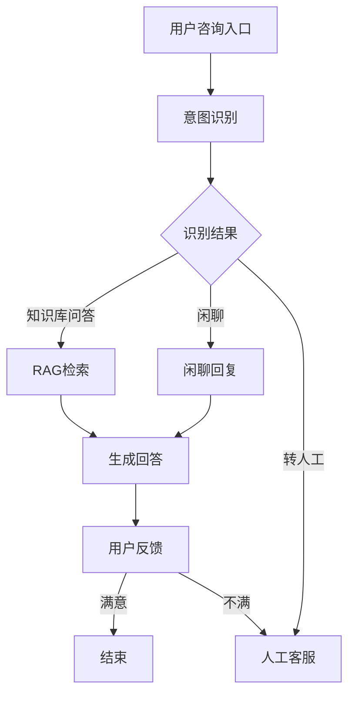

<!--
  文件描述: PRD编写规范详解，涵盖产品需求文档的写作标准、模板、AI产品特殊性及评审流程
  作者: AI-PM-Knowledge
  创建日期: 2026-06-03
  最后修改日期: 2026-06-04
-->

# PRD编写规范

> Product Requirements Document，产品需求文档的编写标准与最佳实践

---

## 前置知识

学习本章前，建议先掌握以下内容：

| 前置章节 | 为什么需要 | 关联点 |
|---------|----------|-------|
| [用户需求分析](./用户需求分析.md) | 需求是PRD的核心输入 | PRD将需求转化为可执行的文档 |
| [用户画像](./用户画像.md) | 用户分析是PRD的必要章节 | 画像为PRD提供用户侧的依据 |
| [MVP设计](./MVP设计.md) | MVP方案需要通过PRD落地 | PRD是MVP方案的文档化表达 |
| [能力模型](../00-Roadmap/能力模型.md) | 了解PRD编写能力等级 | PRD编写是产品基础能力的核心要素 |

**能力对标**：本章对应 [能力模型](../00-Roadmap/能力模型.md) 中「产品设计 → PRD编写」能力维度，掌握PRD规范可帮助你从 L1（能按模板填写）提升至 L3（能写可执行PRD）。

**学习阶段**：本章对应 [年度学习计划](../00-Roadmap/年度学习计划.md) 中1月第3周的学习内容，建议产出1份完整的AI产品PRD文档。

---

## 一、PRD概述

### 1.1 什么是PRD

**PRD（Product Requirements Document）** 是产品需求文档的简称，它描述了产品的目标、功能、行为和验收标准，是产品团队、设计团队、开发团队之间的核心沟通载体。

### 1.2 PRD的价值

```
PRD解决的问题：

开发团队 ←→ PRD ←→ 设计团队
    ↑              ↑
    │              │
  "要做什么"    "做成什么样"
        ↑        ↑
        └──┬──┘
           ↓
      统一的产品理解
```

| 价值点 | 说明 |
|--------|------|
| 统一认知 | 团队对产品理解一致 |
| 减少返工 | 提前发现和解决设计问题 |
| 提高效率 | 减少沟通成本和误解 |
| 便于追溯 | 记录决策过程和原因 |

### 1.3 AI产品PRD的特殊性

```markdown
## AI产品PRD新增章节

### Prompt设计规范
- Prompt模板
- 输入输出格式
- 边界处理

### 效果评估标准
- 准确率要求
- 错误容忍度
- 兜底策略

### 数据要求
- 训练数据需求
- 评测数据要求
- 数据更新机制

### 成本考量
- Token消耗估算
- 成本控制策略
- 降级方案
```

---

## 二、PRD编写原则

### 2.1 核心原则

```
PRD编写六原则：

1. 清晰（Clear）
   └── 避免歧义，每个需求只有一种解释

2. 完整（Complete）
   └── 覆盖所有场景，包括异常情况

3. 一致（Consistent）
   └── 内部术语、格式统一

4. 可验证（Verifiable）
   └── 需求可以被测试和验证

5. 可行（Feasible）
   └── 技术上可以实现

6. 可追溯（Traceable）
   └── 每个需求可以追溯到来源
```

### 2.2 常见问题

| 问题 | 表现 | 后果 |
|------|------|------|
| 模糊描述 | "用户界面要好看" | 理解不一致 |
| 功能堆砌 | 罗列功能清单 | 重点不突出 |
| 忽略异常 | 只描述正常流程 | 上线后各种bug |
| 过度设计 | 考虑所有可能的变化 | 开发成本高 |
| 缺少验收标准 | "做到最好" | 无法判断完成 |

---

## 三、PRD标准模板

### 3.1 文档结构

```markdown
# [产品名称] PRD

## 1. 文档信息
## 2. 背景与目标
## 3. 用户分析
## 4. 产品概述
## 5. 功能需求
## 6. AI能力需求
## 7. 非功能需求
## 8. 验收标准
## 9. 风险与假设
## 10. 排期计划
```

---

## 四、PRD各章节详解

### 4.1 文档信息

```markdown
## 1. 文档信息

| 字段 | 内容 |
|------|------|
| 文档名称 | AI客服系统 PRD |
| 文档版本 | v1.0 |
| 创建日期 | 2024-01-15 |
| 最后更新 | 2024-01-20 |
| 产品负责人 | 张三 |
| 设计负责人 | 李四 |
| 开发负责人 | 王五 |
| 状态 | 评审中 |

### 版本历史

| 版本 | 日期 | 修改人 | 修改内容 |
|------|------|--------|---------|
| v0.1 | 01-15 | 张三 | 初稿 |
| v0.5 | 01-18 | 张三 | 增加异常流程 |
| v1.0 | 01-20 | 张三 | 评审通过定稿 |
```

### 4.2 背景与目标

```markdown
## 2. 背景与目标

### 2.1 背景

#### 市场背景
- 用户对客服响应速度要求越来越高
- 人工客服成本持续上升
- 竞品已开始引入AI客服

#### 用户背景
- 80%的咨询是重复问题
- 用户期望24小时即时响应
- 用户希望能自助解决问题

#### 技术背景
- 大模型技术成熟，AI对话成为可能
- RAG技术可解决知识库问答
- 成本可控

### 2.2 产品目标

#### 业务目标
- 将客服成本降低40%
- 用户问题解决率提升至85%
- 用户满意度提升至90%

#### 产品目标
- 上线首月，覆盖Top 50常见问题
- AI直接解决60%咨询
- 转人工率低于30%

#### AI效果目标
- 回答准确率 > 90%
- 平均响应时间 < 3秒
- 用户采纳率 > 65%

### 2.3 成功指标

| 指标 | 当前值 | 目标值 | 测量方法 |
|------|--------|--------|---------|
| AI解决率 | 0 | 60% | 埋点统计 |
| 用户满意度 | 75% | 90% | 评价打分 |
| 响应时间 | 30秒 | 3秒 | 日志统计 |
| 成本节省 | 0 | 40% | 成本对比 |
```

### 4.3 用户分析

```markdown
## 3. 用户分析

### 3.1 目标用户

#### 用户画像
| 维度 | 描述 |
|------|------|
| 用户类型 | 电商平台买家 |
| 典型场景 | 购买前咨询、订单问题、售后问题 |
| 核心诉求 | 快速得到准确答案 |
| AI接受度 | 中高（已习惯智能客服） |

### 3.2 用户分类

| 用户类型 | 占比 | 特征 | AI客服适配度 |
|---------|------|------|-------------|
| 快速查询型 | 50% | 只想快速知道答案 | 高 |
| 谨慎确认型 | 30% | 需要详细解释确认 | 中 |
| 投诉抱怨型 | 15% | 情绪化，需要安抚 | 低 |
| 闲聊试探型 | 5% | 随便问问 | 低 |

### 3.3 用户场景

#### 场景1：查询物流
```
用户：我的订单到哪了？
AI：[查询订单状态] 您的订单已于今天上午10:30签收，收件人是您本人。
用户：好的，谢谢
AI：祝您购物愉快！
```

#### 场景2：退货咨询
```
用户：我想退货
AI：了解，请问是什么原因想退货呢？
用户：不喜欢
AI：[识别为退货咨询] 关于退货政策，7天内不影响二次销售可以申请退货。
    请问需要我帮您申请退货吗？
```

#### 场景3：AI无法回答
```
用户：[复杂的技术问题]
AI：抱歉，这个问题比较专业，我帮您转接人工客服，请稍等。
    [转接中，前面有2位用户等待，预计等待3分钟]
```
```

### 4.4 功能需求

```markdown
## 5. 功能需求

### 5.1 功能总览



### 5.2 核心功能

#### 功能1：智能问答

**功能描述**
用户输入问题，AI根据知识库内容生成回答。

**用户流程**
1. 用户输入问题
2. 系统识别用户意图
3. 系统检索知识库
4. 系统生成回答
5. 用户查看回答
6. 用户评价或追问

**功能详情**

| 字段 | 说明 |
|------|------|
| 输入 | 用户问题（文字） |
| 输出 | AI回答（文字） |
| 最大输入长度 | 500字 |
| 最大输出长度 | 1000字 |
| 超时时间 | 10秒 |

**业务规则**
- 首次响应时间 < 3秒
- 支持多轮对话（最多10轮）
- 10轮后自动转人工
- 支持追问和澄清

**异常流程**
| 异常 | 处理方式 |
|------|---------|
| 问题无法理解 | "我不太明白您的问题，请换个方式描述" |
| 知识库无答案 | "这个问题我暂时无法回答，帮您转人工" |
| 模型超时 | "抱歉，回答较慢，请稍等" + 重试 |
| 模型错误 | 记录错误，转人工处理 |

#### 功能2：意图识别

**功能描述**
根据用户问题识别用户意图，对接不同处理模块。

**意图分类**
| 意图 | 占比 | 处理方式 |
|------|------|---------|
| 订单查询 | 25% | 知识库问答 |
| 物流查询 | 20% | 知识库问答 |
| 退换货 | 20% | 知识库问答 |
| 活动咨询 | 15% | 知识库问答 |
| 投诉建议 | 10% | 转人工 |
| 闲聊 | 5% | 闲聊回复 |
| 其他 | 5% | 兜底回复 |

**识别置信度**
| 置信度 | 处理方式 |
|--------|---------|
| > 80% | 直接按意图处理 |
| 50%-80% | 按意图处理 + 确认 |
| < 50% | 追问澄清 |

#### 功能3：转人工

**功能描述**
当AI无法解决问题时，转接到人工客服。

**触发条件**
- 用户明确要求转人工
- AI连续3次无法理解
- 知识库无答案
- 用户追问超过10轮
- 用户表达不满情绪

**转接流程**
1. 系统提示用户正在转接
2. 显示当前等待人数
3. 预估等待时间
4. 转移对话上下文
5. 人工接管

### 5.3 用户反馈

**反馈收集**
- 每轮回答后显示👍👎按钮
- 用户可选填反馈原因
- 差评自动触发转人工

**反馈数据**
| 数据 | 用途 |
|------|------|
| 点赞数 | 评估回答质量 |
| 点踩数 | 发现问题 |
| 反馈原因 | 优化方向 |
| 后续操作 | 评估兜底效果 |
```

### 4.5 AI能力需求

```markdown
## 6. AI能力需求

### 6.1 AI对话能力

#### Prompt设计

**系统Prompt**
```markdown
你是店铺智能客服助手，专门解答用户的购物咨询。
要求：
1. 回答简洁、专业、易懂
2. 不确定的问题不乱说，转人工处理
3. 注意安抚情绪激动的用户
4. 回答后询问是否还有其他问题
```

**用户输入处理**
```markdown
处理规则：
1. 敏感词过滤
2. 表情符号保留
3. 错别字容错识别
4. 方言转标准语
```

#### 模型要求

| 参数 | 要求 |
|------|------|
| 模型 | GPT-4 / Claude-3 |
| Temperature | 0.3（偏低，保证准确性） |
| Max Tokens | 1000 |
| Top P | 0.9 |
| 系统Prompt长度 | < 2000字 |

### 6.2 RAG知识库

#### 知识库结构
```markdown
知识库分层：
├── 通用FAQ
│   ├── 退换货政策
│   ├── 物流查询方式
│   └── 活动时间
├── 商品知识
│   ├── 商品规格
│   ├── 使用方法
│   └── 注意事项
├── 售后知识
│   ├── 退款流程
│   ├── 赔偿政策
│   └── 投诉渠道
└── 场景话术
    ├── 催单
    ├── 道歉
    └── 挽留
```

#### Chunk策略
| 类型 | 策略 | 适用内容 |
|------|------|---------|
| 政策类 | 按段落 | 退换货政策 |
| 商品类 | 按字段 | 商品参数 |
| 流程类 | 按步骤 | 退款流程 |
| 话术类 | 整段保留 | 客服话术 |

### 6.3 效果评估

#### 评测数据集
```markdown
评测数据集要求：
├── 数量：至少500条
├── 来源：真实用户问题 + 合成
├── 分布：覆盖各意图类型
├── 标注：人工标注正确回答
└── 更新：每月更新10%

意图分布：
| 意图 | 数量 | 占比 |
|------|------|------|
| 订单查询 | 150 | 30% |
| 退换货 | 100 | 20% |
| 物流查询 | 100 | 20% |
| 其他 | 150 | 30% |
```

#### 评估指标
| 指标 | 定义 | 目标值 |
|------|------|--------|
| 准确率 | 回答正确的比例 | > 90% |
| 召回率 | 相关知识被召回的比例 | > 85% |
| 幻觉率 | 回答与知识库不符的比例 | < 5% |
| 采纳率 | 用户点赞的比例 | > 65% |

### 6.4 兜底机制

```markdown
## 兜底策略

### 兜底层级
1. 知识库回答（首选）
2. 置信度低时追问
3. 转人工处理

### 兜底触发条件
| 条件 | 触发动作 |
|------|---------|
| 意图识别置信度 < 50% | 追问确认 |
| 知识库召回为空 | 转人工 |
| 模型连续2次超时 | 转人工 |
| 用户表达不满 | 转人工 |
| 用户明确要求 | 转人工 |

### 降级方案
| 级别 | 触发条件 | 降级动作 |
|------|---------|---------|
| 正常 | - | 全部功能 |
| 降级1 | API响应慢 | 简化Prompt |
| 降级2 | API超时 | 固定回复 + 留言 |
| 降级3 | API不可用 | 纯人工客服 |
```
```

### 4.6 非功能需求

```markdown
## 7. 非功能需求

### 7.1 性能要求
| 指标 | 要求 |
|------|------|
| 首Token响应时间 | < 1秒 |
| 完整回复时间 | < 3秒 |
| 系统可用性 | 99.9% |
| 并发支持 | 1000 QPS |

### 7.2 安全要求
- 用户隐私数据加密存储
- 对话记录脱敏处理
- 防注入攻击
- 防DDoS攻击

### 7.3 合规要求
- 不生成虚假信息
- 不泄露用户隐私
- 不做诱导性回答
- 支持内容审核

### 7.4 成本要求
| 项目 | 目标值 |
|------|--------|
| 单次对话成本 | < ¥0.1 |
| 日均Token消耗 | < 1亿 |
| 月度API成本 | < ¥5万 |
```

### 4.7 验收标准

```markdown
## 8. 验收标准

### 8.1 功能验收

#### 核心功能
| 功能 | 验收条件 | 测试方法 |
|------|---------|---------|
| 智能问答 | 能正确回答Top 50问题 | 自动化测试 |
| 意图识别 | 准确率 > 85% | 评测数据集 |
| 转人工 | 能成功转接 | 人工测试 |
| 多轮对话 | 支持10轮上下文 | 人工测试 |

#### 异常流程
| 场景 | 验收条件 | 测试方法 |
|------|---------|---------|
| 无法理解 | 提示追问或转人工 | 边界测试 |
| 超时 | 10秒内响应或降级 | 压力测试 |
| API异常 | 自动降级到人工 | 故障演练 |

### 8.2 效果验收

#### 评测报告
```markdown
评测报告要求：
├── 测试日期：
├── 测试人员：
├── 测试数据集：500条
├── 测试结果：
│   ├── 准确率：92%
│   ├── 召回率：88%
│   ├── 幻觉率：3%
│   └── 采纳率：68%
├── 问题案例分析：
└── 优化建议：
```

### 8.3 性能验收

| 指标 | 验收条件 | 测试方法 |
|------|---------|---------|
| 响应时间 | P95 < 3秒 | 压力测试 |
| 可用性 | 99.9% | 7天监控 |
| 并发 | 1000 QPS稳定 | 负载测试 |

### 8.4 上线标准

```markdown
## 上线检查清单

### 效果指标
- [ ] 准确率 > 90%
- [ ] 召回率 > 85%
- [ ] 采纳率 > 65%
- [ ] 转人工率 < 30%

### 功能完成
- [ ] 核心流程验收通过
- [ ] 异常流程验收通过
- [ ] 性能指标达标

### 运营准备
- [ ] 知识库内容审核通过
- [ ] 监控告警配置完成
- [ ] 应急预案已制定
- [ ] 运营人员培训完成

### 技术准备
- [ ] 代码review通过
- [ ] 测试覆盖 > 80%
- [ ] 安全扫描通过
- [ ] 文档齐全
```
```

---

## 五、AI产品PRD示例

### 5.1 完整PRD示例（AI写作助手）

```markdown
# AI写作助手 PRD v1.0

## 1. 文档信息

| 字段 | 内容 |
|------|------|
| 产品名称 | AI写作助手 |
| 文档版本 | v1.0 |
| 创建日期 | 2024-01-15 |
| 产品负责人 | 张三 |

## 2. 背景与目标

### 2.1 背景
内容创作者每天需要产出大量文章，写作效率低、灵感枯竭是核心痛点。

### 2.2 目标
帮助内容创作者快速生成文章初稿，提升写作效率50%。

### 2.3 成功指标
| 指标 | 目标值 |
|------|--------|
| 生成采纳率 | > 60% |
| 节省时间 | > 50% |
| 用户满意度 | > 85% |

## 3. 用户分析

### 3.1 目标用户
- 自媒体创作者（小红书、公众号）
- 企业市场文案人员
- 需要快速产出内容的运营人员

### 3.2 核心场景
1. 选题确定后，快速生成文章框架
2. 写作遇到瓶颈，AI续写
3. 文章完成后，润色改写

## 4. 功能需求

### 4.1 核心功能

#### 功能：大纲生成
- **输入**：主题 + 关键词 + 风格
- **输出**：3个文章大纲供选择
- **规则**：
  - 每个大纲包含5-8个要点
  - 支持选择展开
  - 支持修改顺序

#### 功能：AI续写
- **输入**：已有文章片段
- **输出**：续写内容
- **规则**：
  - 自动学习上文风格
  - 每次续写200-500字
  - 支持修改和重新生成

#### 功能：润色改写
- **输入**：选中文字 + 润色要求
- **输出**：改写后内容
- **规则**：
  - 支持多种风格（正式/活泼/简洁）
  - 保留原意
  - 显示改动点

### 4.2 异常处理
| 异常 | 处理 |
|------|------|
| 输入为空 | 提示"请先输入内容" |
| 主题敏感 | 提示"该主题暂不支持" |
| 生成超时 | 提示重试 |
| 内容违规 | 不生成，提示修改 |

## 5. AI能力需求

### 5.1 Prompt模板

```markdown
【系统Prompt】
你是一个专业的文章写作助手，帮助用户生成高质量的文章内容。

【写作规则】
1. 内容积极正面，符合平台规范
2. 逻辑清晰，层次分明
3. 语言流畅，避免AI味
4. 适当使用emoji和段落分隔

【输出格式】
使用Markdown格式输出
```

### 5.2 效果评估
| 指标 | 目标值 |
|------|--------|
| 相关性 | > 85% |
| 流畅性 | > 80% |
| 原创度 | > 70% |

## 6. 验收标准

- [ ] 大纲生成成功率达到95%
- [ ] 续写采纳率达到60%
- [ ] 用户满意度达到85%
- [ ] 无明显幻觉问题
```

---

## 六、PRD管理规范

### 6.1 评审流程

```
PRD评审流程：

1. 初稿撰写 → 内部评审（产品内部）
    ↓ 通过
2. 设计评审 → 设计团队确认
    ↓ 通过
3. 技术评审 → 开发团队确认
    ↓ 通过
4. 评审通过 → 锁定版本
```

### 6.2 版本管理

| 状态 | 说明 |
|------|------|
| Draft | 草稿，可修改 |
| In Review | 评审中，小修改可接受 |
| Approved | 评审通过，锁定 |
| Implemented | 已开发完成 |
| Obsolete | 已废弃 |

### 6.3 常见错误

| 错误 | 正确做法 |
|------|---------|
| PRD太详细 | 聚焦核心需求，详细规格评审时再定 |
| 缺少验收标准 | 每个需求都有可验证的验收条件 |
| 不更新 | 变更必须同步更新PRD |
| 没人维护 | 指定负责人，定期review |

---

## 七、转行者实践建议

从传统产品转型AI产品的同学，在编写PRD时需要特别注意以下要点：

### 7.1 传统PRD vs AI产品PRD

| 维度 | 传统PRD | AI产品PRD | 转型要点 |
|------|---------|----------|---------|
| 功能描述 | 确定性输入→确定性输出 | 不确定性输入→不确定性输出 | 增加AI效果评估标准 |
| 异常处理 | 边界条件有限 | AI幻觉、超时、不可用等 | 异常流程占比更高 |
| 新增章节 | 无 | Prompt设计、效果评估、兜底机制 | 必须掌握AI相关章节的写法 |
| 验收标准 | 功能是否实现 | 还需评估AI效果是否达标 | 增加「效果验收」维度 |
| 成本意识 | 主要关注研发成本 | 还需关注API调用成本 | 增加成本估算章节 |
| 迭代节奏 | 需求稳定后开发 | AI效果需要持续优化 | PRD中预留优化空间 |

### 7.2 实践练习

```markdown
## 练习1：传统PRD改造（2小时）

选择一份你写过的传统产品PRD，增加AI产品所需的章节：
1. 添加「AI能力需求」章节
2. 设计Prompt模板
3. 定义效果评估指标和目标值
4. 设计兜底机制
5. 估算API调用成本

## 练习2：AI产品PRD从0到1（4小时）

选择一个AI产品场景，从0编写完整PRD：
推荐场景：
- AI简历优化助手
- AI学习计划生成器
- AI代码Review工具

要求：
1. 使用标准模板（参考第三章）
2. 包含AI能力需求章节
3. 定义明确的效果评估标准
4. 设计完整的兜底机制
5. 估算月度API成本

## 练习3：PRD评审模拟（1小时）

找2-3位同学互相评审PRD：
1. 评审重点：AI效果标准是否明确、兜底是否完整
2. 记录评审意见
3. 修改PRD
4. 产出：评审记录 + 修改后的PRD
```

### 7.3 常见误区

| 误区 | 表现 | 正确做法 |
|------|------|---------|
| 忽略AI效果标准 | "AI要准确" | 定义具体指标：准确率>90%、幻觉率<5% |
| Prompt写太粗 | "你是一个助手" | 详细的角色设定、规则、输出格式 |
| 忘记兜底机制 | 只写正常流程 | 每个AI功能都要有降级方案 |
| 不估算成本 | 上线后才发现太贵 | PRD中增加成本估算章节 |
| 验收标准模糊 | "效果好就行" | 用评测数据集+指标量化验收 |
| 忽略数据需求 | 不写训练/评测数据要求 | 明确数据来源、标注标准、更新机制 |

---

## 八、自检清单

### 完整性检查
- [ ] 背景目标清晰
- [ ] 用户分析完整
- [ ] 功能描述详细
- [ ] AI能力要求明确（Prompt设计、效果评估）
- [ ] 验收标准可验证
- [ ] 异常流程覆盖
- [ ] 成本估算合理

### 质量检查
- [ ] 术语统一
- [ ] 格式规范
- [ ] 无歧义描述
- [ ] 逻辑连贯

### AI产品专项
- [ ] Prompt模板是否详细可执行？
- [ ] 效果评估指标是否量化？
- [ ] 兜底/降级机制是否完整？
- [ ] 数据需求是否明确（训练/评测/更新）？
- [ ] API成本是否估算？

### 实践产出
- [ ] 是否完成了至少1份AI产品PRD？
- [ ] PRD是否经过评审并修改？
- [ ] 产出是否可归入 [年度学习计划](../00-Roadmap/年度学习计划.md) 的作品集？

---

> **下一步**：学习「[产品生命周期](./产品生命周期.md)」，了解产品从诞生到退出的完整过程管理。
