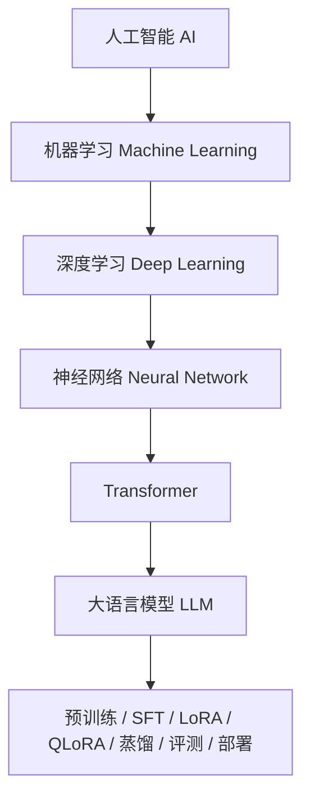
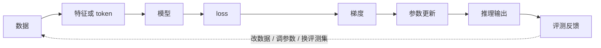
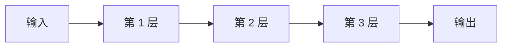
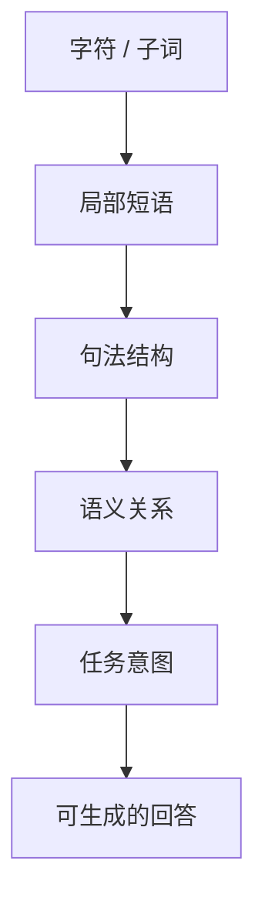
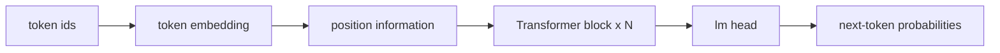
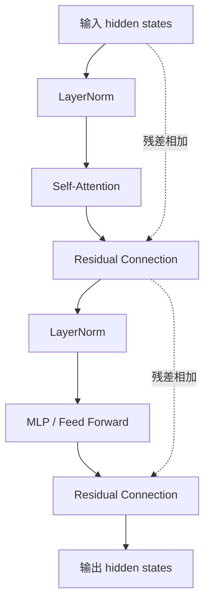
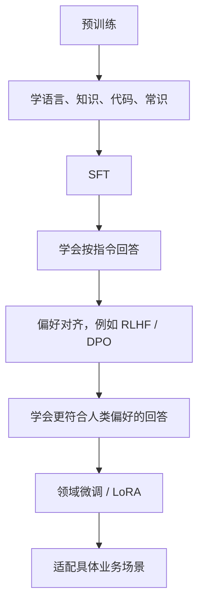
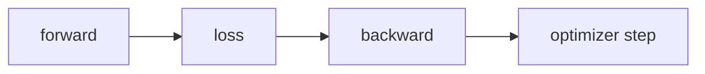
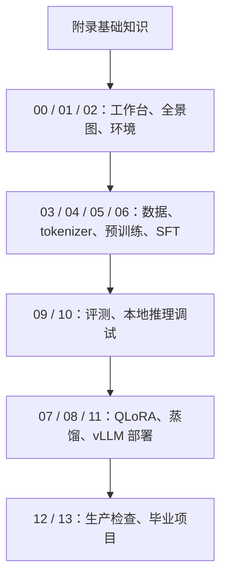

# 附录：大模型开发需要补齐的基础知识

本附录回答一个很常见的问题：

```text
我想学大模型开发，但机器学习、深度学习、神经网络、Transformer、PyTorch、TensorFlow 这些基础还不牢，应该先补什么？
```

本课程 00 到 13 章更偏工程实战：数据、训练、微调、评测、推理、部署。这个附录则偏“地基”。它不会把你带进复杂公式推导，而是帮你建立足够清楚的概念地图，让你知道每个术语在大模型项目里到底负责什么。

## A.0 先给一张总图

可以把这些概念按层次理解：



再换成更工程化的说法：



大模型开发不是只会调用 `model.generate()`。你至少需要知道：

- 数据为什么能影响模型行为
- 模型参数是怎么被训练出来的
- loss 下降和业务效果为什么不是一回事
- Transformer 为什么适合处理语言
- PyTorch / TensorFlow 这样的框架到底帮你做了什么
- Hugging Face Transformers、PEFT、TRL、vLLM 又分别站在哪一层

## A.1 机器学习是什么

传统编程通常是：

```text
规则 + 输入 -> 输出
```

例如：

```python
if order_status == "signed" and user_says_not_received:
    return "请先核实签收人、门卫、快递柜和代收点信息。"
```

机器学习更像是：

```text
数据 + 目标 -> 学出规则
```

你给模型很多历史样本：

```text
用户问题：订单显示已签收但我没收到怎么办？
客服回答：请先核实签收人、门卫、快递柜和代收点信息...

用户问题：商品买错了怎么退款？
客服回答：如果订单还未发货，可以直接申请退款...
```

模型并不是记住一条 `if` 规则，而是从大量样本中学习输入和输出之间的统计关系。

机器学习的核心问题可以简化成一句话：

```text
让模型在没见过的新输入上，也能给出尽量正确的输出。
```

这就是泛化能力。

## A.2 监督学习、无监督学习、自监督学习

### 监督学习

监督学习有明确答案。

```text
输入：这条评论很好
标签：正面
```

或者：

```text
输入：订单显示已签收但没收到怎么办？
答案：请先核实签收人、门卫、快递柜...
```

本课程里的 SFT 就属于监督学习的一种形态。第 06 章用 `messages` 数据告诉模型：

```text
看到这样的 user message，就应该生成这样的 assistant message。
```

### 无监督学习

无监督学习没有人工标注的答案，模型从数据本身发现结构。例如：

- 把相似用户聚成一类
- 从文本中发现主题
- 从行为日志里发现异常模式

### 自监督学习

大语言模型的预训练通常属于自监督学习。它不需要人工逐条标注答案，而是从文本本身构造训练目标。

最典型的目标是：

```text
根据前面的 token，预测下一个 token。
```

例如：

```text
输入：订单显示已签收但我没有
目标：收到
```

第 05 章的教学型预训练就是这个思想。

## A.3 模型、参数和训练

模型可以先理解成一个带很多旋钮的函数：

```text
output = model(input, parameters)
```

这里的 `parameters` 就是模型参数，也可以叫权重。

训练前，这些参数大多是随机初始化的。随机模型当然不会回答问题，所以训练要做的事情是：

```text
不断调整参数，让模型输出越来越接近目标答案。
```

训练循环通常长这样：

```text
1. 取一批训练数据
2. 模型做一次预测
3. 计算预测和正确答案之间的差距，也就是 loss
4. 根据 loss 计算梯度
5. 用优化器更新参数
6. 重复很多轮
```

这也是你在第 05、06、07 章里看到 `Trainer`、`TrainingArguments`、`learning_rate`、`batch_size` 的原因。

## A.4 loss 是什么

loss 可以理解成“模型错得有多离谱”的数值。

在语言模型里，模型每一步都在预测下一个 token 的概率分布。

例如正确下一个 token 是：

```text
收到
```

如果模型给它很高概率，loss 就低。

如果模型给它很低概率，反而把高概率给了别的 token，loss 就高。

但要特别注意：

```text
loss 下降不等于业务效果一定变好。
```

原因包括：

- 训练集太小，模型可能只是背题
- 验证集和真实业务分布不同
- loss 只关心 token 预测，不直接关心客服答案是否完整
- 模型可能说得流畅，但漏掉业务关键词

这就是第 09 章为什么要讲业务评测和相似训练样本分析。

## A.5 梯度、反向传播和优化器

训练模型时，最关键的问题是：

```text
这么多参数，到底每个参数应该往哪个方向调？
```

梯度就是这个方向提示。

如果某个参数稍微增大一点能让 loss 下降，优化器就倾向于把它往增大的方向调。反过来，如果增大会让 loss 上升，就往减小的方向调。

反向传播负责从 loss 一层层往回计算每个参数的梯度。

优化器负责根据梯度更新参数。常见优化器包括：

- SGD
- Adam
- AdamW

在大模型训练里，常见配置项有：

- `learning_rate`：每次更新参数的步子有多大
- `weight_decay`：防止参数过度膨胀
- `gradient_accumulation_steps`：用多个小 batch 累积出一个较大的有效 batch
- `max_grad_norm`：防止梯度爆炸

如果学习率太大，训练可能不稳定；如果太小，训练可能很慢甚至学不动。

## A.6 什么是神经网络

神经网络可以理解成很多层函数叠在一起：



每层都做两类事情：

```text
线性变换 + 非线性激活
```

线性变换负责把输入映射到新的空间，非线性激活让模型能表达复杂关系。

如果没有非线性，很多层线性变换叠起来本质上还是一个线性变换，表达能力会很有限。

一个极简的全连接网络可以写成：

```python
import torch

model = torch.nn.Sequential(
    torch.nn.Linear(10, 32),
    torch.nn.ReLU(),
    torch.nn.Linear(32, 2),
)
```

它表示：

```text
10 维输入 -> 32 维隐藏表示 -> 2 维输出
```

大语言模型复杂很多，但它仍然是神经网络，只是结构换成了 Transformer，参数规模也大得多。

## A.7 深度学习是什么

深度学习就是使用多层神经网络进行学习。

“深”通常指层数很多。传统机器学习往往依赖人工特征，例如你手工设计：

```text
问题长度
是否包含“退款”
是否包含“发票”
是否包含“签收”
```

深度学习更倾向于让模型自己从数据中学习表示。

在大语言模型里，文本会先变成 token id，再变成 embedding，随后经过很多 Transformer 层。模型会在这些层里逐步形成更抽象的表示：



这不是严格的一层对应一个含义，而是帮助理解的近似图。

## A.8 embedding 是什么

神经网络不能直接处理字符串，所以文本要先变成数字。

tokenizer 会把文本变成 token id：

```text
订单显示已签收 -> [1024, 87, 391, 215]
```

但 token id 只是编号，不包含连续语义。embedding 层会把每个 id 映射成一个向量：

```text
1024 -> [0.12, -0.03, 0.51, ...]
87   -> [-0.22, 0.18, 0.09, ...]
```

向量空间里，相似含义的 token 或句子通常会更接近。

这也是相似样本检索可以成立的基础。第 09 章的 `retrieve-semantic` 就是在利用语义向量寻找相近问题。

## A.9 RNN、CNN 和 Transformer 的区别

在 Transformer 成为主流之前，文本模型常见结构包括 RNN、LSTM、GRU、CNN。

### RNN / LSTM / GRU

RNN 按顺序读文本：

```text
第 1 个词 -> 第 2 个词 -> 第 3 个词 -> ...
```

优点是天然适合序列，缺点是长距离依赖和并行训练比较困难。

LSTM / GRU 改进了 RNN 的记忆能力，但在超大规模训练和长上下文上仍然不如 Transformer 方便。

### CNN

CNN 最早在图像任务里非常流行，也可以用于文本。它擅长抓局部模式，例如相邻几个词构成的短语。

但语言理解经常需要跨很远的位置建立关系，CNN 需要堆很多层才能扩大感受野。

### Transformer

Transformer 的关键是 attention。它允许序列里的每个位置直接关注其他位置。

例如：

```text
订单显示已签收，但我没有收到，怎么办？
```

模型在生成回答时，需要同时关注：

- `订单`
- `已签收`
- `没有收到`
- `怎么办`

attention 让这些词之间可以直接建立联系。

## A.10 Transformer 的核心结构

一个 decoder-only Transformer 可以粗略理解成：



每个 Transformer block 里通常有：



你不需要一开始就背公式，但要理解这些组件的作用。

## A.11 Self-Attention 是什么

Self-Attention 解决的是：

```text
当前位置生成表示时，应该参考上下文里的哪些位置？
```

例如模型看到：

```text
订单显示已签收但我没收到
```

在理解“没收到”时，它应该强烈关注“已签收”和“订单”，而不是只看最近一个字。

Self-Attention 会为每个 token 计算它和其他 token 的相关性，然后把相关信息加权汇总。

常见解释会提到 Q、K、V：

- Query：当前位置想找什么信息
- Key：每个位置能提供什么索引
- Value：每个位置真正携带的信息

注意力分数来自 Query 和 Key 的匹配程度，最后用这些分数加权 Value。

## A.12 Multi-Head Attention 是什么

一个注意力头只能从一种角度看关系。多头注意力让模型同时从多个角度看文本。

例如同一句话：

```text
订单显示已签收但我没收到
```

不同 attention head 可能关注：

- 物流状态关系
- 用户诉求
- 关键业务词
- 需要补充核实的信息

这不是说每个 head 都能被人工清楚命名，而是说多头结构提高了模型表达不同关系的能力。

## A.13 位置编码为什么重要

Self-Attention 本身不天然知道顺序。

如果只看一堆 token，模型需要额外信息区分：

```text
用户取消了订单
订单取消了用户
```

所以 Transformer 需要位置信息。常见方式包括：

- 绝对位置编码
- 相对位置编码
- RoPE
- ALiBi

大模型里经常会看到 RoPE，因为它适合长上下文扩展和 decoder-only 架构。

## A.14 Decoder-only、Encoder-only、Encoder-Decoder

Transformer 有几类常见形态。

### Encoder-only

代表模型：BERT。

适合：

- 文本分类
- 匹配
- 抽取
- 句向量

它更擅长理解，不直接按自回归方式生成长文本。

### Encoder-Decoder

代表模型：T5、早期机器翻译模型。

适合：

- 翻译
- 摘要
- 输入到输出的转换任务

### Decoder-only

代表模型：GPT、Llama、Qwen 等主流大语言模型。

适合：

- 对话
- 续写
- 代码生成
- 工具调用
- 多轮推理

本课程主要围绕 decoder-only causal language model 展开。

## A.15 为什么大模型是“预测下一个 token”

大语言模型生成文本时，并不是一次性写完整个答案，而是一步步生成：

```text
用户：可以开发票吗？
助手：可以
助手：可以，
助手：可以，请
助手：可以，请提供
...
```

每一步模型都会根据已有上下文预测下一个 token 的概率分布。

训练时也是类似目标：

```text
给定前面的 token，预测下一个 token。
```

这个目标很简单，但当数据足够大、模型足够大时，会产生很强的语言建模能力。

## A.16 预训练、SFT、RLHF、DPO 的关系

可以把大模型训练分成几个阶段：



本课程覆盖：

- 第 05 章：教学型预训练
- 第 06 章：最小 SFT
- 第 07 章：LoRA / QLoRA
- 第 08 章：蒸馏

没有展开 RLHF / DPO，是因为它们对数据、标注和训练流程要求更高，适合在掌握 SFT 和评测后再学。

## A.17 LoRA 和 QLoRA 放在基础图里的哪里

全量微调会更新模型的大量参数，显存成本很高。

LoRA 的思路是：

```text
冻结原模型参数，只训练一小部分低秩 adapter 参数。
```

这样可以显著降低训练成本。

QLoRA 再进一步：

```text
用 4bit 量化加载基座模型，同时训练 LoRA adapter。
```

所以 QLoRA 不是一种新模型结构，而是一套省显存的微调方法。

第 07 章会把这个概念落到配置和脚本上。

## A.18 PyTorch 是什么

PyTorch 是深度学习框架。它主要帮你做几件事：

- 表示张量
- 在 CPU / GPU 上做高效计算
- 自动求导
- 组织神经网络层
- 管理训练循环
- 保存和加载模型参数

极简训练代码大概是：

```python
import torch

x = torch.tensor([[1.0], [2.0], [3.0], [4.0]])
y = torch.tensor([[2.0], [4.0], [6.0], [8.0]])

model = torch.nn.Linear(1, 1)
optimizer = torch.optim.SGD(model.parameters(), lr=0.01)
loss_fn = torch.nn.MSELoss()

for step in range(200):
    pred = model(x)
    loss = loss_fn(pred, y)

    optimizer.zero_grad()
    loss.backward()
    optimizer.step()

print(model(torch.tensor([[5.0]])))
```

这段代码在学一个很简单的规律：

```text
y = 2x
```

大模型训练复杂得多，但训练骨架仍然是：



第 05、06 章使用 Hugging Face `Trainer`，它帮你封装了大量训练循环细节，但底层仍然是 PyTorch。

## A.19 TensorFlow 是什么

TensorFlow 也是深度学习框架，和 PyTorch 处在同一层。

它同样提供：

- 张量计算
- 自动求导
- 神经网络层
- 模型保存
- 训练和部署工具

TensorFlow 生态里常见高层接口是 Keras。

一个极简 Keras 模型大概是：

```python
import tensorflow as tf

model = tf.keras.Sequential([
    tf.keras.layers.Dense(32, activation="relu"),
    tf.keras.layers.Dense(1),
])

model.compile(optimizer="adam", loss="mse")
```

在大语言模型工程里，目前开源 LLM 训练和微调教程更常见的是 PyTorch + Hugging Face 生态。本课程也选择 PyTorch 路线，因为：

- Hugging Face Transformers 的 LLM 使用体验更成熟
- PEFT、TRL、bitsandbytes、vLLM 等常用工具主要围绕 PyTorch 使用
- 大多数开源权重和社区示例默认使用 PyTorch

这不表示 TensorFlow 不重要，而是本课程为了降低学习分支，只把它作为了解项。

## A.20 PyTorch、Transformers、PEFT、TRL、vLLM 的分工

这些名字经常一起出现，初学者很容易混在一起。

可以这样分层：

| 工具 | 负责什么 | 本课程哪里用 |
| --- | --- | --- |
| PyTorch | 张量计算、自动求导、模型参数 | 第 05、06、07 章底层训练 |
| Transformers | 加载模型、tokenizer、Trainer、生成接口 | 第 04、05、06、10 章 |
| Datasets | 读取和处理训练数据 | 第 05、06 章 |
| PEFT | LoRA / QLoRA adapter | 第 07、08、11 章 |
| TRL | SFTTrainer 等微调工具 | 第 07 章 |
| bitsandbytes | 4bit / 8bit 量化加载 | 第 07 章 |
| vLLM | 高吞吐推理服务 | 第 11 章 |

所以当你看到一个训练脚本时，可以先问：

```text
它是在用 PyTorch 做底层计算？
还是用 Transformers 加载模型？
还是用 PEFT 挂 LoRA？
还是用 TRL 简化 SFT？
```

分清层次后，排错会容易很多。

## A.21 CUDA、GPU 和显存

深度学习训练需要大量矩阵计算，GPU 比 CPU 更适合做这件事。

CUDA 是 NVIDIA GPU 的计算平台。很多训练工具依赖 CUDA 才能在 NVIDIA GPU 上加速。

常见环境问题包括：

- 机器有显卡，但 PyTorch 检测不到 CUDA
- NVIDIA 驱动版本不匹配
- PyTorch CUDA 版本不匹配
- `bitsandbytes` 无法加载
- 显存不足导致 OOM

第 02 章的 `make env-check` 就是为了提前发现这些问题。

要记住：

```text
有 GPU 不等于训练一定能跑。
PyTorch 能检测到 CUDA，才说明训练框架能使用 GPU。
```

## A.22 batch、epoch、step

这三个词非常常见。

### batch

一次送进模型的一小批样本。

```text
batch_size = 4
```

表示每次用 4 条样本计算一次 loss。

### step

通常指一次参数更新。

如果开启梯度累积，多个小 batch 才会合成一次 optimizer step。

### epoch

完整看完训练集一遍。

例如训练集有 1000 条样本，batch size 是 10，那么一个 epoch 大约有 100 个 batch。

大模型训练里，epoch 不一定越多越好。小数据集跑太多 epoch 很容易过拟合。

## A.23 过拟合和欠拟合

欠拟合是模型还没学会。

表现可能是：

- 训练 loss 高
- 验证效果差
- 输出混乱
- 连训练集问题也答不好

过拟合是模型把训练集记得太死。

表现可能是：

- 训练 loss 很低
- 训练集回答很好
- 新问题效果差
- 输出和训练样本高度相似

第 09 章的相似样本检索就是为了发现“模型是不是在背题”。

## A.24 评测为什么是独立能力

很多新手会以为：

```text
训练跑完 = 模型可用
```

实际上训练跑完只说明脚本执行成功，不说明模型适合业务。

评测要回答：

- 正确率如何
- 是否覆盖关键业务点
- 是否出现幻觉
- 是否拒答过多
- 是否泄露敏感信息
- 是否在背训练样本
- 延迟和成本能不能接受

所以第 09、12、13 章非常重要。它们让课程从“会训练”走向“会判断模型能不能用”。

## A.25 推荐学习顺序

如果你基础比较薄，可以按这个顺序补：

```text
1. 机器学习：监督学习、训练集、验证集、泛化
2. 神经网络：参数、层、激活函数、loss、梯度
3. 深度学习：多层网络、embedding、GPU 训练
4. Transformer：attention、decoder-only、next token prediction
5. PyTorch：tensor、autograd、nn.Module、optimizer
6. Hugging Face：tokenizer、AutoModel、Trainer、generate
7. 大模型工程：SFT、LoRA、评测、推理服务、生产检查
```

对应本课程阅读顺序可以调整为：



如果已经有机器学习基础，可以跳过本附录，只在遇到术语卡住时回来查。

## A.26 最小可运行练习

如果你当前环境已经能运行 PyTorch，可以试这个极小练习：

```bash
python3 -c '
import torch

x = torch.tensor([[1.0], [2.0], [3.0], [4.0]])
y = 2 * x

model = torch.nn.Linear(1, 1)
optimizer = torch.optim.SGD(model.parameters(), lr=0.05)
loss_fn = torch.nn.MSELoss()

for _ in range(200):
    prediction = model(x)
    loss = loss_fn(prediction, y)
    optimizer.zero_grad()
    loss.backward()
    optimizer.step()

print(model(torch.tensor([[5.0]])).item())
'
```

输出接近 `10`，说明模型学到了 `y = 2x` 这个简单规律。

它和大模型训练的关系是：

```text
小练习：输入数字，预测数字
大模型：输入 token，预测下一个 token

小练习：线性层参数更新
大模型：Transformer 大量参数更新

小练习：MSE loss
大模型：cross entropy loss
```

结构不同，规模不同，但训练思想是一脉相承的。

## A.27 常见误解

### 误解一：大模型就是数据库

大模型不是精确数据库。它生成的是概率最高的 token 序列，所以会出现幻觉。需要准确事实时，要结合检索、工具调用或业务系统。

### 误解二：训练数据越多越好

数据越多不一定越好。低质量、重复、冲突、过期的数据会伤害模型。第 03 章的数据清洗非常关键。

### 误解三：loss 低就可以上线

loss 只是训练指标。上线前还要看业务评测、安全、延迟、监控和回滚方案。

### 误解四：TensorFlow 和 PyTorch 必须都精通

不需要。入门大模型工程，先专注 PyTorch + Hugging Face 更高效。理解框架本质后，再迁移到其他生态会容易很多。

### 误解五：Transformer 公式不会背就不能做工程

不需要先背完整公式。你应该先理解 attention、token、loss、训练循环和显存约束，再逐步深入数学细节。

## A.28 本附录验收标准

读完后，你应该能用自己的话解释：

- 机器学习和传统编程的区别
- 深度学习和神经网络的关系
- loss、梯度、优化器分别是什么
- embedding 为什么是文本进入模型的第一步
- Transformer 为什么适合语言建模
- decoder-only 模型为什么能生成文本
- PyTorch 和 TensorFlow 是哪一层工具
- Transformers、PEFT、TRL、vLLM 分别负责什么
- 为什么本课程既讲训练，也讲评测、推理和部署

如果这些问题能讲清楚，再回到 00 到 13 章，很多脚本和配置就不会只是“照着跑”，而是能看懂它们为什么这样写。
