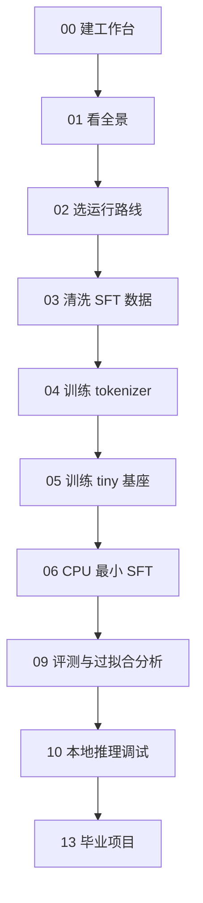
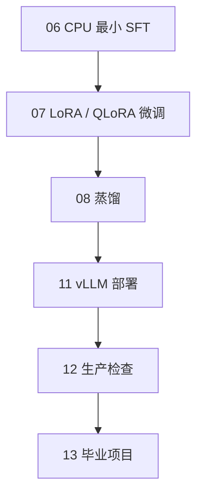

# 大模型开发入门课程

这是一套按章节推进的大模型开发入门课程。它不是术语速查表，而是一条可以从本地教学 demo 走到 GPU 微调、评测、部署和生产复盘的工程路线。

课程围绕同一个案例展开：

```text
电商客服助手
```

它会处理：

- 发票问题
- 订单签收问题
- 待揽收问题
- 退款问题
- 退货问题
- 地址修改问题
- 物流异常问题

## 适合谁

适合：

- 有 Python 基础
- 会使用命令行
- 想完整理解大模型项目从数据到部署的开发者
- 想先用 CPU 跑通教学闭环，再迁移到 GPU 微调的人

不适合直接期待：

```text
从零训练生产级大模型
用几条样本得到高质量客服机器人
在没有 NVIDIA GPU 的机器上强行跑 QLoRA
```

## 配套材料

- 主教程：`codex/llm_development_beginner_tutorial.md`
- 工程入口：`codex/README.md`
- 教学讲义：[training_handout.md](./training_handout.md)
- 排障手册：[troubleshooting.md](./troubleshooting.md)
- QLoRA GPU 实战指南：[qlora_gpu_walkthrough.md](./qlora_gpu_walkthrough.md)
- 基础知识附录：[机器学习、深度学习、神经网络、Transformer 与框架基础](./appendix-foundations.md)
- 术语表：[大模型开发术语速查](./glossary.md)
- 章节测试题：[每章自测与参考答案](./chapter-quizzes.md)
- 学习进度表：[路线、里程碑与个人记录](./learning-progress.md)

## 课程目录

| 序号 | 章节 | 学习时长 | 核心产物 |
| ---: | --- | ---: | --- |
| 00 | [序章：搭好你的大模型开发学习工作台](./00-preface.md) | 45 分钟 | 工程骨架、公共工具、环境检查入口 |
| 01 | [第一章：用代码搭出大模型开发全景图](./01-llm-development-map.md) | 90 分钟 | 电商客服助手完整流水线地图 |
| 02 | [第二章：环境与工程目录](./02-environment-and-project-setup.md) | 75 分钟 | 环境检查结果、CPU/GPU 路线选择 |
| 03 | [第三章：数据工程是模型质量的地基](./03-data-engineering-for-llm.md) | 90 分钟 | SFT `messages` 数据、rejected、summary |
| 04 | [第四章：Tokenizer 与模型看到的世界](./04-tokenizer-and-pretraining-basics.md) | 90 分钟 | `outputs/tokenizer_chat_demo/` |
| 05 | [第五章：教学型预训练实战](./05-tiny-pretraining-practice.md) | 100 分钟 | `outputs/pretrain_chat_demo/` |
| 06 | [第六章：SFT 让模型学会回答](./06-sft-and-chat-data.md) | 100 分钟 | `outputs/sft_minimal_cpu_local/` |
| 07 | [第七章：LoRA / QLoRA 微调实战](./07-lora-and-qlora-finetuning.md) | 120 分钟 | LoRA adapter、显存配置选择 |
| 08 | [第八章：蒸馏，把大模型能力迁移给小模型](./08-distillation.md) | 90 分钟 | teacher answers、student adapter |
| 09 | [第九章：评测，不要被 loss 骗了](./09-evaluation-and-overfitting-analysis.md) | 100 分钟 | 业务评测报告、相似样本分析 |
| 10 | [第十章：本地推理与交互式调试](./10-local-inference-and-debugging.md) | 80 分钟 | 单次推理、REPL 调试方法 |
| 11 | [第十一章：vLLM 部署成 API 服务](./11-vllm-deployment.md) | 90 分钟 | OpenAI 兼容模型服务 |
| 12 | [第十二章：从 demo 到生产的检查清单](./12-production-checklist.md) | 75 分钟 | 上线前检查清单 |
| 13 | [第十三章：毕业项目，训练一个客服助手](./13-capstone-project.md) | 120 分钟 | 完整项目报告 |
| 附录 | [基础知识：机器学习、深度学习、神经网络、Transformer 与框架](./appendix-foundations.md) | 90 分钟 | 概念地图、框架分层、最小 PyTorch 练习 |
| 速查 | [术语表：大模型开发常见词](./glossary.md) | 随用随查 | loss、LoRA、adapter、vLLM 等术语解释 |
| 测试 | [章节测试题](./chapter-quizzes.md) | 每章 10 分钟 | 自测题、操作题、参考答案 |
| 进度 | [学习进度表](./learning-progress.md) | 持续使用 | 路线计划、里程碑、个人记录 |

## 推荐路线

### 30 分钟快速体验

如果你只是想先确认这个仓库能不能跑起来，可以先不读完所有章节，直接执行：

```bash
make env-check
make report-eval-sample
make retrieve-similar
```

这三条命令不会启动长时间训练，也不需要 GPU。它们可以快速验证：

```text
Python 环境是否可用
样例评测报告是否能生成
相似训练样本分析是否能运行
```

确认没问题后，再进入 CPU 教学路线或 GPU QLoRA 路线。

### CPU 教学路线

适合没有 NVIDIA GPU 的本地环境。

```bash
make env-check
make pipeline-local
make infer-repl
make retrieve-similar
make report-eval-sample
```

重点学习：

```text
数据如何流动
配置如何驱动脚本
tokenizer / pretraining / SFT 如何衔接
模型输出如何分析
```

这条路线不追求模型质量。

### GPU QLoRA 路线

适合 Linux + NVIDIA GPU 环境。

```bash
make env-check
make prepare-sft
make sft-8gb
```

或按显存选择：

```bash
make sft-16gb
make sft-24gb
```

后续可继续：

```bash
make merge-lora
make serve-vllm MODEL=outputs/qwen25_cs_merged
make eval-business
make report-eval
```

重点学习：

```text
如何微调开源模型
如何保存 adapter
如何合并和部署
如何用业务评测判断效果
```

### 只想先看课程

如果你还没有配置好环境，建议按这个阅读顺序：

```text
基础薄弱：先读附录基础知识
00 -> 01 -> 02
03 -> 04 -> 05 -> 06
09 -> 10
07 -> 08 -> 11
12 -> 13
```

这样可以先理解本地闭环，再看 GPU 和部署章节。

如果你已经熟悉机器学习和深度学习，可以跳过附录；如果你对 loss、梯度、神经网络、Transformer、PyTorch / TensorFlow 的概念不稳，建议先读附录再进入 04、05、06 章。

## 章节之间怎么衔接

这套课程不是 14 篇互不相关的文章，而是一条持续复用产物的工程链路。

下面的流程图使用 Mermaid 编写。如果你的 Markdown 阅读器不支持 Mermaid，它可能会显示为代码块；换到支持 Mermaid 的预览器即可正常显示。即使不能渲染，也不影响继续学习，因为每张图旁边都有文字路线说明。



如果你有 GPU，可以在第 06 章之后走另一条增强路线：



其中第 09 章和第 10 章并不只服务于 CPU 路线。无论你训练的是 tiny 教学模型、QLoRA adapter，还是合并后的部署模型，都需要用评测和推理调试来判断效果。

## 关键产物流转

读每章时，可以重点记住这些产物关系：

| 产物 | 由谁产生 | 被谁使用 |
| --- | --- | --- |
| `data/sft/customer_support_prepared.jsonl` | 第 03 章 `make prepare-sft` | 第 06、07、08 章训练 |
| `outputs/tokenizer_chat_demo/` | 第 04 章 `make tokenizer-chat-demo` | 第 05、06 章本地教学训练 |
| `outputs/pretrain_chat_demo/` | 第 05 章 `make pretrain-chat-demo` | 第 06 章最小 SFT |
| `outputs/sft_minimal_cpu_local/` | 第 06 章 `make sft-minimal` | 第 09、10、13 章 CPU 路线评测和推理 |
| LoRA adapter 目录 | 第 07、08 章 GPU 训练 | 第 11 章合并与部署 |
| `outputs/eval/*.jsonl` / `*.md` | 第 09、11、13 章评测 | 第 12 章生产复盘、第 13 章项目报告 |

如果某个命令报“找不到文件”，通常不是脚本本身的问题，而是它依赖的上游章节还没有跑完。先回到这张表确认缺的是哪个产物。

## 运行前提醒

课程里有三类命令。

第一类：本地教学命令，通常 CPU 可跑：

```bash
make env-check
make prepare-sft
make tokenizer-chat-demo
make pretrain-chat-demo
make sft-minimal
make infer-minimal
make report-eval-sample
```

第二类：需要模型服务：

```bash
make eval-business
make distill-generate
```

第三类：通常需要 NVIDIA GPU：

```bash
make sft-8gb
make sft-16gb
make sft-24gb
make distill-train
make merge-lora
make serve-vllm
```

如果命令失败，先看：

```bash
make env-check
```

再查：

[troubleshooting.md](./troubleshooting.md)

## 学习方法

每章都不要只看命令是否跑完。

你应该同时完成三件事：

```text
能运行命令
能找到输出产物
能解释为什么会产生这些产物
```

建议每学完一章，打开 [章节测试题](./chapter-quizzes.md) 做一次自测，再在 [学习进度表](./learning-progress.md) 勾掉对应里程碑。

如果你能按第 13 章完成毕业项目报告，就说明你已经不只是“会跑脚本”，而是理解了一条大模型开发链路。
